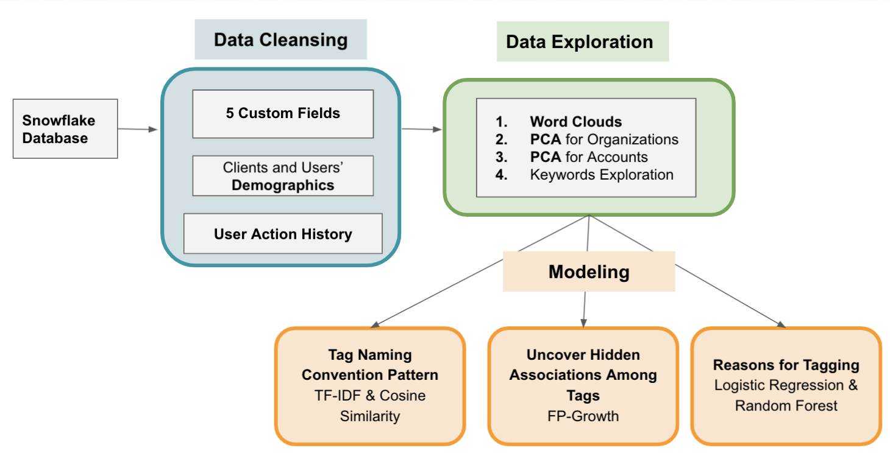

# STATS 170 AB: Data Science Senior Capstone Project

## Project Sponsor 
[Paciolan LLC](https://www.paciolan.com/ "Paciolan's Homepage")

## Project Topic
Uncovering Patterns of Custom Text Fields Usage for Client Tagging

## Team Members 
Yihan Wang (Marlene), Sirui Hu (Katherine), Yadi Yang (Max) 

## Background
Paciolan is a company aiming to serve the business clients, such as the university sports and venues, and provide a better platform for them to serve their customers, e.g. patrons and donors. 

## Goal
To derive business insights in helping define user categories and user potential interests from user-defined tags that were assigned to each user.

## Objective
To find out similar characteristics among users who have been assigned common custom tags.
Features will be processed in a data analysis pipeline.

## Data Processing Pipeline Overview

## Source Code 
All code with outputs and notebook instances are stored in [notebooks](./notebooks):

- The folder ["HTML_version_with_outputs"](./notebooks/HTML_version_with_outputs/) contains the completed runs of all the real data
  - It also stores the notebooks (with outputs) that do not appear in "notebooks" folder. We saved the records here in html format as they are only the attempts we made and did not perform very well during the progress.

- The notebook instances only run with the [sample data](./sample_data):

  - **1.Data Retrieval** 

    - Cleans and Wrangles all the dirty data from Paciolan snowflake to AWS S3 Bucket. For reference only, please don't run it.

  - **2.Word Clouds**

    - Generates a few word clouds for the sample tag data

  - **3.1 PCA_of_Accounts**

    - Performs dimensionality reduction on account-level data with two sample organizations (USC & OKLAHOMA)

  - **3.2 PCA of Organizations**

    - Performs dimensionality reduction on organization-level data

  - **4.Tag Dendrogram Graph**

    - Processes tags using TF-IDF and Cosine Similarity approaches, and it clusters the tags hierarchically

  - **5.1 Reason of Tagging (Logistic Version)**

    - Runs logistic regression model with USC sample data to predict if an account will be assigned a certain tag

  - **5.2 Reason of Tagging (Random Forest Version)**

    - Runs random forest model with USC sample data to predict if an account will be assigned a certain tag

  - **6.Tags Co-occurrence Frequency**

    - Runs Association Rule Mining with sample tag data

      

## Tools/Softwares
### Database:
Paciolan Snowflake Data Warehouse, AWS S3 Bucket
### Compiler/IDE: 
Jupyter Notebook, Google Colab, VS Code
### Programming Language:
Python
### Packages: 
- Snowflake connector: snowflake.connector
- AWS S3 connector: boto3, botocore, s3fs
- Data Wrangling: numpy, pandas, json
- Data Analysis: scikit-learn, scipy, statsmodel, pyspark
- Data Visualization: matplotlib, seaborn, plotly
### Communication:
Slack, Email, Zoom

## License
See [LICENSE](./LICENSE)
